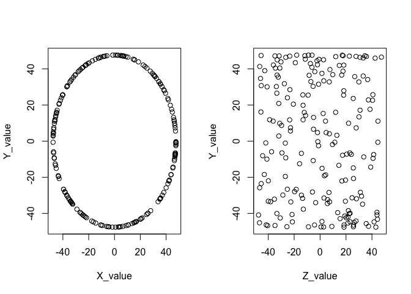

# Using persistence barcodes to detect relationships in the presence of delayed oscillations
Luke Wolcott  

### Abstract

We give examples, using simulated data, of how topological data analysis can be used to detect relationships in a system with delayed oscillations.  This Markdown file accompanies and explains the R scripts and barcode images contained in the GitHub repo github.com/lukewolcott/TDAwithSimulatedData.git.  

## Introduction

The GitHub repo TDAwithSimulatedData.git contains R scripts that generate simulated data sets and compute their persistence barcodes using the "TDA" package.  Each is a variation on a theme: delayed oscillation.  If two variables X and Y oscillate over time with a phase shift -- the classic example being predator and prey populations --  then in XY-space they trace a circle.  If a third variable Z affects the amplitude of these oscillations, then in XYZ-space the data will make a shape that reflects this relationship.  Adding additional variables pushes the data set into higher dimensions.

Topological data analysis is an excellent tool for understanding the high-dimensional shape of such a data set.  Persistent homology measures the "shape" of the data set on different scales.  If the data forms a bubble, or a cylinder, or a cone (or high-dimensional analogs of these) this will be detected in an output of the persistence algorithm: the barcode.

In this Markdown file we will work through several examples of such data sets and their barcodes.  The goal is to show how the barcode detects relationships between variables, in the presence of delayed oscillations.  The first three examples are in XYZ-space, and the last example adds a fourth parameter.  We organize the examples based on how Z affects the amplitude of oscillation, and finish with some concluding comments.

## 1. bell_bubble: Z has a sweet spot

This example corresponds to bell_bubble.R.  Imagine that variables X and Y form a system of delayed oscillation, with magnitude that depends on a third variable Z.  This parameter Z has an optimum value where oscillations are at a maximum, and to either side of this the oscillations die off to zero.  For example, Z could be temperature in a predator/prey system: too hot or too cold and everything dies.  Or Z could be oxygen level in an aquatic ecosystem.

At the optimum Z value the data might fit into the XY-space as follows.


```r
set.seed(137)
t <- runif(200)
x <- 100*sin(2*pi*t)/2.1
y <- 100*cos(2*pi*t)/2.1
plot(x,y,main="Delayed oscillations make a circle in phase space")
```

<!-- -->

For simplicity we assume the optimum Z-value is at zero, and the magnitude dies off as a bell curve.


```r
z <- runif(200, -0.95, 0.95)
magnitude <- exp(-(z^2)/.4)
plot(z,magnitude,main="Simulation of Z's sweet spot")
```

<!-- -->

The following code generates a data set of 200 records that might arise from measuring this system.  It is a 200 by 3 data frame with columns "X_value", "Y_value", and "Z_value".  All variables are scaled to stay between -50 and 50.


```r
x <- magnitude*100*sin(2*pi*t)/2.1
y <- magnitude*100*cos(2*pi*t)/2.1
w <- cbind(x,y,100*z/2.1)     
d <- as.data.frame((w))
names(d) <- c("X_value", "Y_value", "Z_value")
```

Plotting the Y_value versus X_value gives a circular mess.  Plotting, say, the Y_value versus Z_value shows a bell-curved mess.


```r
par(mfrow = c(1,2))
plot(d$X_value, d$Y_value,xlab="X_value",ylab="Y_value")
plot(d$Z_value, d$Y_value,xlab="Z_value",ylab="Y_value")
```

<!-- -->

The key is that really this data lives in three dimensions, and in fact makes a nice bubble in three dimensions.  We can get a sense of this if we color the points according to their Z_value.  Notice that the darkest and lightest points are in the center, and the middle-blue points are towards the outside.


```r
library(ggplot2)
qplot(X_value, Y_value, data=d, color=Z_value)
```

<!-- -->

We can plot this (and move it around!) in 3D using the plotly package.  (This only works if viewing in HTML, not PDF.)


```r
library(plotly)
plot_ly(x = d$X_value, y = d$Y_value, z=d$Z_value, type="scatter3d", mode="markers", color = d$Z_value)
```

<!--html_preserve--><div id="htmlwidget-a1611a81d12c5825ee96" style="width:672px;height:480px;" class="plotly html-widget"></div>
<script type="application/json" data-for="htmlwidget-a1611a81d12c5825ee96">{"x":{"layout":{"margin":{"b":40,"l":60,"t":25,"r":10},"showlegend":false,"xaxis":{"domain":[0,1]},"yaxis":{"domain":[0,1]}},"source":"A","config":{"modeBarButtonsToAdd":[{"name":"Collaborate","icon":{"width":1000,"ascent":500,"descent":-50,"path":"M487 375c7-10 9-23 5-36l-79-259c-3-12-11-23-22-31-11-8-22-12-35-12l-263 0c-15 0-29 5-43 15-13 10-23 23-28 37-5 13-5 25-1 37 0 0 0 3 1 7 1 5 1 8 1 11 0 2 0 4-1 6 0 3-1 5-1 6 1 2 2 4 3 6 1 2 2 4 4 6 2 3 4 5 5 7 5 7 9 16 13 26 4 10 7 19 9 26 0 2 0 5 0 9-1 4-1 6 0 8 0 2 2 5 4 8 3 3 5 5 5 7 4 6 8 15 12 26 4 11 7 19 7 26 1 1 0 4 0 9-1 4-1 7 0 8 1 2 3 5 6 8 4 4 6 6 6 7 4 5 8 13 13 24 4 11 7 20 7 28 1 1 0 4 0 7-1 3-1 6-1 7 0 2 1 4 3 6 1 1 3 4 5 6 2 3 3 5 5 6 1 2 3 5 4 9 2 3 3 7 5 10 1 3 2 6 4 10 2 4 4 7 6 9 2 3 4 5 7 7 3 2 7 3 11 3 3 0 8 0 13-1l0-1c7 2 12 2 14 2l218 0c14 0 25-5 32-16 8-10 10-23 6-37l-79-259c-7-22-13-37-20-43-7-7-19-10-37-10l-248 0c-5 0-9-2-11-5-2-3-2-7 0-12 4-13 18-20 41-20l264 0c5 0 10 2 16 5 5 3 8 6 10 11l85 282c2 5 2 10 2 17 7-3 13-7 17-13z m-304 0c-1-3-1-5 0-7 1-1 3-2 6-2l174 0c2 0 4 1 7 2 2 2 4 4 5 7l6 18c0 3 0 5-1 7-1 1-3 2-6 2l-173 0c-3 0-5-1-8-2-2-2-4-4-4-7z m-24-73c-1-3-1-5 0-7 2-2 3-2 6-2l174 0c2 0 5 0 7 2 3 2 4 4 5 7l6 18c1 2 0 5-1 6-1 2-3 3-5 3l-174 0c-3 0-5-1-7-3-3-1-4-4-5-6z"},"click":"function(gd) { \n        // is this being viewed in RStudio?\n        if (location.search == '?viewer_pane=1') {\n          alert('To learn about plotly for collaboration, visit:\\n https://cpsievert.github.io/plotly_book/plot-ly-for-collaboration.html');\n        } else {\n          window.open('https://cpsievert.github.io/plotly_book/plot-ly-for-collaboration.html', '_blank');\n        }\n      }"}],"modeBarButtonsToRemove":["sendDataToCloud"]},"data":[{"x":[-37.0891268376711,15.5557300018326,-23.4938129686842,-45.0831252692962,35.3976513995677,-2.06731312911278,-9.59290813236167,-45.9598094318507,-11.0670051396192,8.22236702449296,-45.0648683089608,-38.854182567151,-33.6965636886902,-17.6512859384759,-2.56226989850978,47.4698237021503,-14.1228007614054,27.8614849059331,30.8294328041548,-21.7907567008592,16.9222879008176,-20.2410979886448,-16.0214403686712,2.80708138243229,23.478724050851,5.1850374003708,-32.8861419041552,10.171929779797,-15.4858476708843,7.84147581059853,-23.1579506232838,-4.24371511441541,43.4384781344643,-21.7643467776683,17.4120437167875,0.595060324947056,-9.16862050771549,21.5232546177565,-31.7471781119251,-38.8329983096683,7.66904183462007,12.7581615027089,4.55484915634914,-45.5168514167626,-22.0690640719916,6.58190296002546,10.0302470698737,-4.64503407972156,15.3726331287277,-0.251999459115174,-2.59062608249301,36.4687494876107,-6.31376189454769,-19.5089287347158,-5.33233249488175,1.74537801370256,12.9774697577677,7.67527495590915,-16.2612849592039,16.0783202127208,-40.1072619716755,36.4417226315444,-14.4821728174153,20.2980693165028,-8.15150187718711,12.4611269612892,-3.89828596952681,-13.6107746227258,-27.4635431615385,-4.17942789898298,-14.2071184976966,19.3597665165604,2.43364174227478,4.94619780266264,-14.8204501532087,5.27450318467016,9.67347534951095,-40.2001681002165,32.6717160756249,1.98079834128099,-11.6438237788066,-3.89136245774611,-31.9795534516818,-19.5153408390464,23.1286442226097,-11.2523892615004,9.89208187915009,21.6811954323361,8.52454561747824,-18.1999346827037,-36.9601053865281,15.4248255507962,-47.1910310422549,27.5977220911798,29.6036661937954,22.1540491242006,44.6289671973464,0.689627872154605,-26.6108359313901,16.5982522238946,1.91348173550113,1.64209579115618,-16.9807851039194,10.1373201040267,-24.9737071215495,-0.973471960586846,-27.9644125923719,-35.677868800957,-5.6106728693081,-26.1382574860426,10.3937943658029,-37.0494220830966,31.8244549287373,4.18194845081148,47.4839124911733,0.563326896345597,-23.2790606284902,-18.56330167857,-4.04028491094991,-35.7441910580747,3.84423406350525,35.6654224360158,4.41634255884699,10.4160969021906,-15.4461094658164,32.8290539934996,10.1441858570338,-16.3188966271096,-14.5527857218394,7.50496333330046,34.772758752118,28.7267147968956,30.1126215348956,6.07865141819255,45.0826302672485,8.33407001692674,-6.90758742209105,8.59348173084036,-3.56410092198131,-19.8467272843564,-28.9650555650916,-1.7940993915607,3.67000586078828,29.2899855628917,28.8796398393474,-7.64447791570473,7.45335661456264,1.6894691920644,6.54306263158514,-17.1795890726818,2.04528146722223,-20.8541929547769,-2.36496643917532,-24.6511350827227,2.70421557675291,7.81272489361263,-41.8502416466616,-43.1133699413388,2.98443218633778,-22.0257351109372,-5.38219826335252,-21.1521422028128,15.0511774862278,-44.8473828069469,-17.2325116809633,43.021090914032,10.3005149028567,-38.7119039515403,26.3444188386245,-10.4318314696385,23.1684836228587,2.41150429069429,11.7885170190119,-46.3500476521427,-3.85283410817801,-28.1211493366273,-33.7466837369636,6.89063597658191,-27.638430640849,-2.78175429616761,8.47934765357463,-2.89458506805441,1.97674233430712,-8.20779093496658,5.5835742392047,15.1779704942691,-8.81186991309425,1.10354760856133,38.2695650370288,-8.63416697707117,-6.94137104908578,-28.0952077929578,-4.41677241687204,-33.6399034661655,-28.5555245201825,-13.1758068339013,28.0128694619301,8.64880756558829,3.94090187367883,16.254326387287],"y":[-27.1851003039534,-25.4292717176766,39.2622216012346,3.86505990665986,-31.1958726301837,7.57646272323388,15.4046117722337,6.41633946858442,-11.9265134707019,-0.173517366880724,-15.0440527968769,13.813318814683,33.1006501140208,3.72824624855441,-4.29562634442489,-0.29193855149952,13.3936366130167,-3.86343354739475,-4.71619030571406,42.1205402068041,-44.4030645932258,-20.1895882705139,30.1197900418291,-6.08548246031495,-7.70441511055797,15.0562090162887,-33.6652755983848,2.60847590773799,7.54936029674626,-7.7824037730818,-4.57400341106724,27.161237570251,-1.73016813916051,12.7187804771313,-23.9275179154058,5.96119725800067,-28.615691265279,12.278157014762,-33.4521044037183,9.94495660863806,40.4474462649178,39.8157984778795,-2.93695632408992,10.8829746881397,-10.6490360444024,-1.13475544139874,3.99453754961365,3.92301293462698,44.7084519996169,-7.48171349825347,-24.5912801451982,-27.1182594309703,1.5076191096896,40.5954425521493,-23.8876910194113,-9.08751343203143,8.70105127251445,12.3224762238967,-13.09027991647,-14.5030132311999,12.5460717248241,16.7019758167396,-28.2992756664683,28.3184652089544,4.39513842107349,2.98342495120136,-5.75682786007745,30.1262465060884,33.43513191425,17.9528026869188,-26.3541480350755,3.58972777869306,17.3796435241864,41.1526373401762,45.2167840038681,-2.99361691025317,-26.1923056693941,2.73303332347775,31.3311420792075,14.0035394271418,-1.4469579274187,-43.7486721233079,-31.8526632204354,-17.075628867823,27.7000698098964,12.5210793559786,-3.13244513371914,3.38276625711251,-1.34890221325227,33.6177050194205,23.3717688555703,17.483961655345,4.72768595919094,19.9386462591594,-26.4090191734351,16.5372319805259,12.7985840256978,43.9726379626326,6.78265051413053,14.8719071133389,-8.25008364731493,-11.6654922642594,44.2008486753717,12.1408484094685,37.3816642566467,34.3542313770925,4.40501382426469,29.4333354087533,-43.4904598551945,-18.9595470184496,-28.3144977896722,-10.8487700661328,-16.6464871162132,34.5428203294482,-2.52969823175688,-33.871349481974,-22.7578961050304,5.45989990031272,15.2797403337511,-9.74747431770249,-12.8597823895268,31.4534057278962,28.2629677010558,5.68600098148443,-24.1568195517693,31.1980436136297,-9.27058460304932,-28.8296446914154,-10.7797617860081,-33.0290058961256,-5.79576223829393,6.09699129892081,-24.3187203336335,11.5039719643274,-10.4952758471481,-16.5177106985247,-6.73155576438364,-4.46576739276031,-5.9390282188354,-2.73705463968656,18.3046156884932,14.3121002840535,-47.4540280565109,37.422899584931,-14.6703342740035,4.89740904258391,17.6110531822821,-5.08615242216318,-0.0854182203250129,6.60759317369193,45.7728317361787,-14.0688057376157,13.0605498848334,-31.8923116608061,4.72203571179725,-22.5426377011373,-0.561519937753482,-18.944206658225,-47.1747497288243,-32.9027418464947,23.0037419756363,-9.52344410991661,-2.81267664282671,15.2001195489615,1.02361720739068,-18.3053717767297,11.9164217070786,13.6886580811697,-4.11014532944296,-45.5707306904033,-0.531630914294808,-24.4711559275072,9.67420334893644,4.628346334893,21.7729416062106,13.3793238538882,-31.3251829807052,-2.900227835064,37.812327215275,-13.9172901326097,-13.1851955034148,-7.90226184216906,35.5037997106648,-20.5703963801852,2.00847912191711,-23.3618123584725,-1.80281498385663,4.95537182024199,-5.50316213764631,8.84813507903383,5.65143768668807,-19.0119258600105,6.30718714136173,21.4241954315618,33.9264200945587,-10.9734560419633,3.32391182151646,-1.84647135677469,4.19329529571807,-33.8326954060406],"z":[-5.6274805450812,-20.6118024397819,-6.01894337284778,6.80557938093054,2.89067632319139,40.4316929002692,-29.5807261807134,-4.83882099367856,31.2098579270588,-39.9109222859676,1.44442198576317,11.4248878344716,2.71140511835083,-29.6709269318464,-45.2099400971617,-1.68216246778944,28.4867300385875,21.852209089723,19.5921417015294,-1.93253139455226,1.38549682728592,-21.5123560434828,17.3916342634974,42.1730738654289,24.3929443104813,-31.520858876008,-3.266411488654,-37.0298213026087,-30.3673101145597,-36.4028704563333,-25.2292848402812,-22.3227785811538,9.0898563808185,-24.0193205952112,20.7723430768099,-43.3621454507201,20.4355098517789,24.3413447247197,5.38884264616562,-12.4976389099001,11.4906981465451,-10.8629671768064,-44.3977664579593,3.96738881134384,24.5484730971622,-42.2095379858677,36.6885572383624,-43.2073366872611,2.5551522427815,40.9657129951354,-24.3802541013186,6.50836439093663,42.5147765371505,-7.10690292707156,24.5698721114812,-38.5475458865542,-31.7929342699548,-32.8245358497259,-27.3493987995954,26.736161804625,-10.6478437659375,-12.4970605109064,19.144795823931,16.8336302962243,38.5382792635244,-34.5065585259969,41.7760679542664,-18.1943028799391,9.32216608032052,29.3404025258496,20.5159915744194,-28.302449195291,-30.0901766522743,-11.2192537735349,-0.821328803985602,-43.2335515783745,22.0046175089443,12.3095363822012,-6.77860987683137,-33.1835746709701,-35.6449442261475,-8.56249601624551,6.96908816517819,23.4793696829694,15.8598413358309,-30.7106207679248,37.1760322978454,26.5090874196695,39.3590109622372,14.1152356651479,-8.79108664202725,25.4503737004208,-1.91326628638697,17.4443618083994,-12.8696384861888,-22.2083408330079,-4.7934764674643,-8.49395144863853,-22.3443105617272,-26.2426198648644,-39.5761113613844,35.5939202165852,-2.26522431753221,-31.6180661608953,7.22432649650035,-17.1984899933228,-21.7185654067656,-5.14037529272692,8.64718037413522,-18.770880918462,-20.3518363281286,13.7963110691912,15.995245494525,16.8697252204376,-1.13680034299337,17.574591279429,18.5725976879309,28.5803407253254,31.6287107710239,-15.087944948824,33.8910082721018,-1.11742501945368,21.4997481166696,35.5005851314802,21.4503804975677,6.74617129289324,-33.5741094734874,18.141753781986,29.6119437796906,17.5784810058152,16.51489145699,20.9388424221071,-13.7100845176194,-34.3045209368159,-5.0706119520501,-29.283220948474,-38.0568773197454,-38.0082143459558,41.8169443340351,-28.0228848646705,17.278107119325,32.9134312901823,0.666492570945547,1.35762514546513,18.6947381678259,38.7714116601273,-28.7663797903362,-44.5117564140154,42.4289967033214,29.3625391531913,-5.91280680992419,-24.0583755142455,34.0401949981848,-12.2950665907757,-44.3565226304123,25.037094295424,10.8188659229892,3.17760700958647,2.58671365390044,12.9377698093387,-25.2143238615688,-25.5408999365976,32.080024675954,2.25316957415392,-30.3370922693007,4.07872357117456,31.6774194782955,-11.593198423673,22.9354154584663,-4.08853750032861,-25.558199179137,24.4838901318698,-32.1371793735861,4.47209224858809,26.3785183496241,-19.6265624137595,5.52234927613643,-40.9802845335521,-3.87686489238626,-33.1356595691648,-31.7455597543379,39.648470092964,16.2755622473058,26.3503516436599,-43.462013661684,22.0505113846489,38.8803725552169,45.0603918006111,-13.7467915247682,34.9738156788849,-38.9366771704296,-17.5385321457205,-40.6525598550659,-12.6808803328978,-8.0389018070751,30.4376435754377,-21.7922205382603,-39.076941233084,-43.7810282710762,14.691591503409],"mode":"markers","type":"scatter3d","marker":{"colorbar":{"title":"","ticklen":2},"cmin":-45.2099400971617,"cmax":45.0603918006111,"colorscale":[["0","rgba(68,1,84,1)"],["0.0254084368908463","rgba(69,12,92,1)"],["0.0769756507499607","rgba(71,30,109,1)"],["0.132685327771266","rgba(71,47,123,1)"],["0.161254949056231","rgba(69,56,128,1)"],["0.188717867712032","rgba(66,64,132,1)"],["0.233422149815623","rgba(61,77,138,1)"],["0.272614147542598","rgba(58,88,139,1)"],["0.348679168224257","rgba(48,108,142,1)"],["0.379010077035357","rgba(46,115,142,1)"],["0.433450175264955","rgba(40,127,142,1)"],["0.459289914256342","rgba(38,134,141,1)"],["0.499970710551416","rgba(37,144,140,1)"],["0.532437039304425","rgba(34,152,138,1)"],["0.575616162826361","rgba(37,162,134,1)"],["0.627664766568326","rgba(47,174,127,1)"],["0.680091256298887","rgba(63,186,117,1)"],["0.695558083270914","rgba(72,189,113,1)"],["0.731402074438643","rgba(90,196,103,1)"],["0.766101236960801","rgba(105,203,93,1)"],["0.792993251391356","rgba(120,207,84,1)"],["0.839080890411801","rgba(151,214,68,1)"],["0.890694000538454","rgba(181,222,44,1)"],["0.939112362036434","rgba(214,226,41,1)"],["1","rgba(253,231,37,1)"]],"showscale":false,"color":[-5.6274805450812,-20.6118024397819,-6.01894337284778,6.80557938093054,2.89067632319139,40.4316929002692,-29.5807261807134,-4.83882099367856,31.2098579270588,-39.9109222859676,1.44442198576317,11.4248878344716,2.71140511835083,-29.6709269318464,-45.2099400971617,-1.68216246778944,28.4867300385875,21.852209089723,19.5921417015294,-1.93253139455226,1.38549682728592,-21.5123560434828,17.3916342634974,42.1730738654289,24.3929443104813,-31.520858876008,-3.266411488654,-37.0298213026087,-30.3673101145597,-36.4028704563333,-25.2292848402812,-22.3227785811538,9.0898563808185,-24.0193205952112,20.7723430768099,-43.3621454507201,20.4355098517789,24.3413447247197,5.38884264616562,-12.4976389099001,11.4906981465451,-10.8629671768064,-44.3977664579593,3.96738881134384,24.5484730971622,-42.2095379858677,36.6885572383624,-43.2073366872611,2.5551522427815,40.9657129951354,-24.3802541013186,6.50836439093663,42.5147765371505,-7.10690292707156,24.5698721114812,-38.5475458865542,-31.7929342699548,-32.8245358497259,-27.3493987995954,26.736161804625,-10.6478437659375,-12.4970605109064,19.144795823931,16.8336302962243,38.5382792635244,-34.5065585259969,41.7760679542664,-18.1943028799391,9.32216608032052,29.3404025258496,20.5159915744194,-28.302449195291,-30.0901766522743,-11.2192537735349,-0.821328803985602,-43.2335515783745,22.0046175089443,12.3095363822012,-6.77860987683137,-33.1835746709701,-35.6449442261475,-8.56249601624551,6.96908816517819,23.4793696829694,15.8598413358309,-30.7106207679248,37.1760322978454,26.5090874196695,39.3590109622372,14.1152356651479,-8.79108664202725,25.4503737004208,-1.91326628638697,17.4443618083994,-12.8696384861888,-22.2083408330079,-4.7934764674643,-8.49395144863853,-22.3443105617272,-26.2426198648644,-39.5761113613844,35.5939202165852,-2.26522431753221,-31.6180661608953,7.22432649650035,-17.1984899933228,-21.7185654067656,-5.14037529272692,8.64718037413522,-18.770880918462,-20.3518363281286,13.7963110691912,15.995245494525,16.8697252204376,-1.13680034299337,17.574591279429,18.5725976879309,28.5803407253254,31.6287107710239,-15.087944948824,33.8910082721018,-1.11742501945368,21.4997481166696,35.5005851314802,21.4503804975677,6.74617129289324,-33.5741094734874,18.141753781986,29.6119437796906,17.5784810058152,16.51489145699,20.9388424221071,-13.7100845176194,-34.3045209368159,-5.0706119520501,-29.283220948474,-38.0568773197454,-38.0082143459558,41.8169443340351,-28.0228848646705,17.278107119325,32.9134312901823,0.666492570945547,1.35762514546513,18.6947381678259,38.7714116601273,-28.7663797903362,-44.5117564140154,42.4289967033214,29.3625391531913,-5.91280680992419,-24.0583755142455,34.0401949981848,-12.2950665907757,-44.3565226304123,25.037094295424,10.8188659229892,3.17760700958647,2.58671365390044,12.9377698093387,-25.2143238615688,-25.5408999365976,32.080024675954,2.25316957415392,-30.3370922693007,4.07872357117456,31.6774194782955,-11.593198423673,22.9354154584663,-4.08853750032861,-25.558199179137,24.4838901318698,-32.1371793735861,4.47209224858809,26.3785183496241,-19.6265624137595,5.52234927613643,-40.9802845335521,-3.87686489238626,-33.1356595691648,-31.7455597543379,39.648470092964,16.2755622473058,26.3503516436599,-43.462013661684,22.0505113846489,38.8803725552169,45.0603918006111,-13.7467915247682,34.9738156788849,-38.9366771704296,-17.5385321457205,-40.6525598550659,-12.6808803328978,-8.0389018070751,30.4376435754377,-21.7922205382603,-39.076941233084,-43.7810282710762,14.691591503409],"line":{"color":"transparent"}}},{"x":[-47.1910310422549,47.4839124911733],"y":[-47.4540280565109,45.7728317361787],"type":"scatter3d","mode":"markers","opacity":0,"hoverinfo":"none","showlegend":false,"marker":{"colorbar":{"title":"","ticklen":2},"cmin":-45.2099400971617,"cmax":45.0603918006111,"colorscale":[["0","rgba(68,1,84,1)"],["0.0254084368908463","rgba(69,12,92,1)"],["0.0769756507499607","rgba(71,30,109,1)"],["0.132685327771266","rgba(71,47,123,1)"],["0.161254949056231","rgba(69,56,128,1)"],["0.188717867712032","rgba(66,64,132,1)"],["0.233422149815623","rgba(61,77,138,1)"],["0.272614147542598","rgba(58,88,139,1)"],["0.348679168224257","rgba(48,108,142,1)"],["0.379010077035357","rgba(46,115,142,1)"],["0.433450175264955","rgba(40,127,142,1)"],["0.459289914256342","rgba(38,134,141,1)"],["0.499970710551416","rgba(37,144,140,1)"],["0.532437039304425","rgba(34,152,138,1)"],["0.575616162826361","rgba(37,162,134,1)"],["0.627664766568326","rgba(47,174,127,1)"],["0.680091256298887","rgba(63,186,117,1)"],["0.695558083270914","rgba(72,189,113,1)"],["0.731402074438643","rgba(90,196,103,1)"],["0.766101236960801","rgba(105,203,93,1)"],["0.792993251391356","rgba(120,207,84,1)"],["0.839080890411801","rgba(151,214,68,1)"],["0.890694000538454","rgba(181,222,44,1)"],["0.939112362036434","rgba(214,226,41,1)"],["1","rgba(253,231,37,1)"]],"showscale":true,"color":[-45.2099400971617,45.0603918006111]},"z":[-45.2099400971617,45.0603918006111]}],"base_url":"https://plot.ly"},"evals":["config.modeBarButtonsToAdd.0.click"],"jsHooks":[]}</script><!--/html_preserve-->

### The barcode

But a better way to detect this bubble in 3D is to use topological data analysis.  We will plot the barcode and then explain what it tells us.


```r
library("TDA")
maxscale <- 70 
maxdimension <- 2
Diag <- ripsDiag(X = d, maxdimension, maxscale, library = "GUDHI")      
plot(Diag[["diagram"]], barcode = TRUE)
mtext("Barcode of bell curve cross circle")
legend("right", lty=c(1,1,1), lwd=c(3,3,3), col=c("blue", "red", "black"), legend=c( "H2", "H1", "H0"))
```

<!-- -->

In this case we're mostly interested in the H1 and H2 elements.  The horizontal axis is labeled "time", but this is a misnomer that the "TDA" package gives and we can't seem to change.  Really this is a filtration parameter for the Vietoris-Rips complex generated by the point cloud, but we won't explain this here.

Each line of red H1 corresponds to a 1-sphere, i.e. a circle, that can be made from the points in the data set.  Each line of blue H2 corresponds to a 2-sphere, i.e. a 2D bubble, like the shape formed by the surface of a globe.  

Our barcode shows us a long blue H2 line, and this is indicating the data forms a 2D bubble, as expected.  

Topology and topological data analysis are best at studying global or qualitative properties of a shape.  For example, "How many holes, of which dimensions, does the shape have?"  It is not the right tool for studying the precise shape of the magnitude curve, just that it generally has a "sweet spot" shape.  Replacing the bell curve with a similar curve, for example the upper half of a circle, would yield more-or-less the same barcode.

## 2. cyl_bubble: Z is unrelated

The next three examples will go a little quicker.  This one corresponds to cyl_bubble.R.  Suppose that our third parameter Z is actually unrelated to the amplitude of oscillation of X and Y.  We will assume that Z is uniformly distributed between -50 and 50, but the result would be the same if its distribution were different.


```r
x <- 100*sin(2*pi*t)/2.1
y <- 100*cos(2*pi*t)/2.1
w <- cbind(x,y,50*z)     
d <- as.data.frame((w))
names(d) <- c("X_value", "Y_value", "Z_value")
```

Plotting Y_value versus X_value, we are looking along the Z-axis and see our circle again.  Plotting Y_value versus Z_value we look along the X-axis and don't see much.


```r
par(mfrow=c(1,2))
plot(d$X_value,d$Y_value,xlab="X_value",ylab="Y_value")
plot(d$Z_value,d$Y_value,xlab="Z_value",ylab="Y_value")
```

<!-- -->

Again, we can plot this in 3D using the plotly package.


```r
library(plotly)
plot_ly(x = d$X_value, y = d$Y_value, z=d$Z_value, type="scatter3d", mode="markers", color = d$Z_value)
```

<!--html_preserve--><div id="htmlwidget-80ca0aceb054593abd1b" style="width:672px;height:480px;" class="plotly html-widget"></div>
<script type="application/json" data-for="htmlwidget-80ca0aceb054593abd1b">{"x":{"layout":{"margin":{"b":40,"l":60,"t":25,"r":10},"showlegend":false,"xaxis":{"domain":[0,1]},"yaxis":{"domain":[0,1]}},"source":"A","config":{"modeBarButtonsToAdd":[{"name":"Collaborate","icon":{"width":1000,"ascent":500,"descent":-50,"path":"M487 375c7-10 9-23 5-36l-79-259c-3-12-11-23-22-31-11-8-22-12-35-12l-263 0c-15 0-29 5-43 15-13 10-23 23-28 37-5 13-5 25-1 37 0 0 0 3 1 7 1 5 1 8 1 11 0 2 0 4-1 6 0 3-1 5-1 6 1 2 2 4 3 6 1 2 2 4 4 6 2 3 4 5 5 7 5 7 9 16 13 26 4 10 7 19 9 26 0 2 0 5 0 9-1 4-1 6 0 8 0 2 2 5 4 8 3 3 5 5 5 7 4 6 8 15 12 26 4 11 7 19 7 26 1 1 0 4 0 9-1 4-1 7 0 8 1 2 3 5 6 8 4 4 6 6 6 7 4 5 8 13 13 24 4 11 7 20 7 28 1 1 0 4 0 7-1 3-1 6-1 7 0 2 1 4 3 6 1 1 3 4 5 6 2 3 3 5 5 6 1 2 3 5 4 9 2 3 3 7 5 10 1 3 2 6 4 10 2 4 4 7 6 9 2 3 4 5 7 7 3 2 7 3 11 3 3 0 8 0 13-1l0-1c7 2 12 2 14 2l218 0c14 0 25-5 32-16 8-10 10-23 6-37l-79-259c-7-22-13-37-20-43-7-7-19-10-37-10l-248 0c-5 0-9-2-11-5-2-3-2-7 0-12 4-13 18-20 41-20l264 0c5 0 10 2 16 5 5 3 8 6 10 11l85 282c2 5 2 10 2 17 7-3 13-7 17-13z m-304 0c-1-3-1-5 0-7 1-1 3-2 6-2l174 0c2 0 4 1 7 2 2 2 4 4 5 7l6 18c0 3 0 5-1 7-1 1-3 2-6 2l-173 0c-3 0-5-1-8-2-2-2-4-4-4-7z m-24-73c-1-3-1-5 0-7 2-2 3-2 6-2l174 0c2 0 5 0 7 2 3 2 4 4 5 7l6 18c1 2 0 5-1 6-1 2-3 3-5 3l-174 0c-3 0-5-1-7-3-3-1-4-4-5-6z"},"click":"function(gd) { \n        // is this being viewed in RStudio?\n        if (location.search == '?viewer_pane=1') {\n          alert('To learn about plotly for collaboration, visit:\\n https://cpsievert.github.io/plotly_book/plot-ly-for-collaboration.html');\n        } else {\n          window.open('https://cpsievert.github.io/plotly_book/plot-ly-for-collaboration.html', '_blank');\n        }\n      }"}],"modeBarButtonsToRemove":["sendDataToCloud"]},"data":[{"x":[-38.4069491958659,24.8491169179832,-24.4511714053987,-47.4450075950559,35.7252590096158,-12.5350727233395,-25.1720168530712,-47.1616682603971,-32.3904642037926,47.6084478143706,-45.1686461100011,-44.8679135399098,-33.9707932452386,-46.5911143463108,-24.3939693359055,47.6181471142096,-34.5518974683192,47.167731762468,47.0714515164466,-21.8806647206062,16.9581394883889,-33.7146227873701,-22.3628222093602,19.9457619107155,45.2453316199764,15.5053009915535,-33.2752678002244,46.1265356803751,-42.8036279040516,33.7988188105615,-46.716524602413,-7.35089405438679,47.5813197946766,-41.1134788169033,28.0189234835537,4.72993481362121,-14.52980321218,41.3621570840115,-32.7800477389533,-46.1303419681305,8.87076938275018,14.5308017687217,40.0207532721617,-46.3136234138675,-42.8872108236703,46.9267383277874,44.2398344799292,-36.3802931816489,15.4836846184327,-1.60299818533128,-4.98893289509426,38.2122559370501,-46.31691784976,-20.6261026150163,-10.374433190912,8.98171249788247,39.5518105321034,25.1760441197936,-37.0936455877186,35.3593704158213,-45.4473762397774,43.2890172317322,-21.6934477516658,27.7418588279661,-41.9145931946534,46.3102607723508,-26.7000089406505,-19.6057959725296,-30.2250103023752,-10.7970361009131,-22.5964295150461,46.820965658004,6.60358673254216,5.68250786403167,-14.8314766005738,41.4136825318897,16.4977112431655,-47.5093789661144,34.369485892821,6.66931683349071,-47.2555709450061,-4.21896823969684,-33.7386199320738,-35.837253350807,30.5201987745625,-31.8295400573906,45.3973115135154,47.0498195910459,47.0338459634208,-22.670850278327,-40.2473366274972,31.5032664619643,-47.3818693510079,38.5991530908542,35.5344495141141,38.1598819608304,45.773976858651,0.746723102291904,-46.143758366606,35.4655462467938,10.7589245599446,6.6376669403497,-17.0771209281602,30.5203980161141,-26.4528529947715,-1.3488064317225,-47.0390286919535,-36.7325189486656,-6.0928057443354,-38.5463524777733,16.4095156919285,-45.700106021873,42.1952351329284,5.72324032552786,47.551614711091,0.791860423023874,-34.0507530333188,-45.6840013603002,-12.1731052418189,-45.9414414844764,13.6386321733171,35.7145541276174,7.35169252392843,41.796968652905,-25.6524263073192,34.5182994648014,35.151302782886,-23.4573082785515,-38.2647282224319,10.5512082648947,46.9710729779295,46.5814429075901,37.0466296218433,22.2469526108872,46.3788496134211,21.4506175233227,-34.103490886518,42.2541397834756,-24.5032554718355,-47.1725714418008,-40.254537867255,-5.9229507038818,3.67180366474822,29.3495653346308,42.455358462946,-40.0963857904912,18.5596210873094,15.0111572035149,47.6149903474127,-44.4449777988085,2.12565551579234,-39.4758075892872,-8.48473809574963,-29.121781454637,23.6646374401465,15.5936322386195,-47.6147618723529,-43.5959956987224,3.00652952072471,-26.4896605410309,-10.8484762870474,-43.4210070322159,46.8087348644482,-45.0991037956422,-47.535259723463,43.8174288134493,31.1404409671694,-44.894964025476,47.0498716206656,-10.6258678667101,47.6065160779587,4.66998731576739,36.810607367826,-47.3833968121973,-8.29752625166483,-43.0002999373099,-34.9006121573389,43.8898873413706,-28.1002334314193,-9.33336700235684,25.7571328114579,-16.3785585737372,2.64718221176907,-17.6475119019852,44.8082725385405,25.94316508836,-46.6526896611859,10.3510605849826,47.1342104731066,-33.2571478635718,-36.9276571502478,-39.4379338701887,-27.3149581172908,-40.1651689461666,-30.6642756394483,-36.5906820337121,47.2873228631911,46.5695570676281,32.6112664494226,20.6213277256722],"y":[-28.1510204008895,-40.621362416117,40.8621329968094,4.06754845702127,-31.4845924992049,45.9395869372561,40.4220640701811,6.58412811550438,-34.9060385149612,-1.00468544902219,-15.078697050296,15.9513018503287,33.3700300034983,9.84082110975088,-40.8963073661183,-0.292850737783206,32.7679733502681,-6.54054864128329,-7.20084358113253,42.294328313966,-44.4971370004574,-33.6288255288595,42.0413829336961,-43.2404934979491,-14.8470085452756,45.0239862440728,-34.063620608627,11.8286263899156,20.8667950197585,-33.5442028248691,-9.22713526601101,47.0482523878019,-1.89517881526887,24.0261431719111,-38.5034235226932,47.3835563545416,-45.3481919679324,23.5954584084032,-34.5404424751199,11.8137735736072,46.785501458285,45.3478720129538,-25.8052902264998,11.073481043628,-20.6944640885233,-8.09042187160194,17.6184772705699,30.7253635318184,45.0314246585874,-47.5920591376644,-47.3569872850181,-28.4147354790873,11.0596933521555,42.9201303243588,-46.4752066387276,-46.7643297476881,26.5184460287122,40.4195558934451,-29.8602604335235,-31.8949622972322,14.2165287276901,19.8402289113788,-42.3906595937227,38.7035265178036,22.5995702054671,11.0875354945087,-39.429471448579,43.3956963353357,36.7970440166929,46.3788497871681,-41.9162864447303,8.68163987948919,47.1589475965157,47.2787774854674,45.2504253901746,-23.5049057707743,-44.6698916484275,3.22995455064835,32.9592496214386,47.1496968083533,-5.87236841543659,-47.4317826266055,-33.6047499800876,-31.3570561184433,36.5525807967963,35.4182731916745,-14.3755975002768,7.34085639385208,-7.44251503420224,41.876082001577,25.4504536411052,35.7087930119683,4.74680449872782,27.8868979417562,-31.6997885462032,28.4850329977098,13.1269470437269,47.6131925074724,11.7612609846648,31.7768583337254,-46.3877056822014,-47.1541628462866,44.451610060268,36.5524144357538,39.595710179035,47.5999413587335,7.40968797336942,30.303394988533,-47.2276551853564,-27.9598356004535,-44.7023656074427,-13.3818535986123,-22.0711537582884,47.2738639876346,-2.53330505724843,-47.6124632130661,-33.2884351390848,13.4367301028641,46.0368244443155,-12.5282740420839,-45.6241318666568,31.496735062711,47.0481276267052,22.8163780555373,-40.1189072719171,32.8033641293605,-32.1241281408694,-41.4406610042615,-28.3440341202262,-46.4353927548367,-7.82892070768042,9.8864995216733,-29.9185716538589,42.1028122062418,-10.7970368472461,-42.5140530179521,-33.2344039437796,-21.958173132199,-40.8309217068032,-6.5055514534377,25.4390620353594,47.2492576778145,-47.4772740792125,37.4990227981125,-21.5665535941162,25.687614577559,43.8533255436874,-45.191136913741,-0.621603057356542,17.0943746480691,47.5715806419474,-26.6314534210715,46.8570476619223,-37.6761932930264,41.3226164584425,-44.9934698567671,-0.638864605572552,-19.1562745642805,-47.5240410359445,-39.5710952661924,46.3668443868514,-19.5496763260515,-8.74734454191185,15.2854353217374,2.82361101571017,-18.644211657333,36.0256385441724,15.8750087022445,-7.34052291216406,-46.4183652041338,-1.09239327359107,-47.3895021562339,30.2084902197524,4.73153280480771,46.8905614622821,20.4584432801352,-32.3963110120294,-18.472993404073,38.4441227919804,-46.6954168687296,-40.0517640744829,-44.7137173045564,47.5454111611501,-44.2282604203965,16.118077064495,-39.9315148891602,-9.54464475620767,46.4804178220371,-6.77789784682618,34.0813117723724,30.0652928397327,-26.687507717952,39.0059836332296,25.5799315806556,36.4317978646822,-30.4745087647513,5.61095291171204,-9.94233627826249,34.6998414507889,-42.922424663287],"z":[-5.90885457233526,-21.642392561771,-6.31989054149017,7.14585834997706,3.03521013935096,42.4532775452826,-31.0597624897491,-5.08076204336249,32.7703508234117,-41.906468400266,1.51664308505133,11.9961322261952,2.84697537426837,-31.1544732784387,-47.4704371020198,-1.76627059117891,29.9110665405169,22.9448195442092,20.5717487866059,-2.02915796427988,1.45477166865021,-22.587973845657,18.2612159766723,44.2817275587004,25.6125915260054,-33.0969018198084,-3.4297320630867,-38.8813123677391,-31.8856756202877,-38.22301397915,-26.4907490822952,-23.4389175102115,9.54434919985943,-25.2202866249718,21.8109602306504,-45.5302527232561,21.4572853443679,25.5584119609557,5.6582847784739,-13.1225208553951,12.0652330538724,-11.4061155356467,-46.6176547808573,4.16575825191103,25.7758967520203,-44.3200148851611,38.5229851002805,-45.3677035216242,2.68290985492058,43.0139986448921,-25.5992668063845,6.83378261048346,44.640515364008,-7.46224807342514,25.7983657170553,-40.4749231808819,-33.3825809834525,-34.4657626422122,-28.7168687395751,28.0729698948562,-11.1802359542344,-13.1219135364518,20.1020356151275,17.6753118110355,40.4651932267006,-36.2318864522967,43.8648713519797,-19.1040180239361,9.78827438433655,30.8074226521421,21.5417911531404,-29.7175716550555,-31.594685484888,-11.7802164622117,-0.862395244184883,-45.3952291572932,23.1048483843915,12.9250132013112,-7.11754037067294,-34.8427534045186,-37.4271914374549,-8.99062081705779,7.3175425734371,24.6533381671179,16.6528334026225,-32.246151806321,39.0348339127377,27.834541790653,41.3269615103491,14.8209974484052,-9.23064097412862,26.7228923854418,-2.00892960070632,18.3165798988193,-13.5131204104982,-23.3187578746583,-5.03315029083751,-8.91864902107045,-23.4615260898136,-27.5547508581076,-41.5549169294536,37.3736162274145,-2.37848553340882,-33.19896946894,7.58554282132536,-18.058414492989,-22.8044936771039,-5.39739405736327,9.07953939284198,-19.7094249643851,-21.369428144535,14.4861266226508,16.7950077692512,17.7132114814594,-1.19364036014303,18.4533208434004,19.5012275723275,30.0093577615917,33.2101463095751,-15.8423421962652,35.5855586857069,-1.17329627042636,22.574735522503,37.2756143880542,22.5228995224461,7.0834798575379,-35.2528149471618,19.0488414710853,31.0925409686752,18.4574050561059,17.3406360298395,21.9857845432125,-14.3955887435004,-36.0197469836567,-5.32414254965261,-30.7473819958977,-39.9597211857326,-39.9086250632536,43.9077915507369,-29.4240291079041,18.1420124752913,34.5591028546914,0.699817199492825,1.42550640273839,19.6294750762172,40.7099822431337,-30.2046987798531,-46.7373442347161,44.5504465384874,30.8306661108509,-6.2084471504204,-25.2612942899577,35.7422047480941,-12.9098199203145,-46.5743487619329,26.2889490101952,11.3598092191387,3.3364873600658,2.71604933659546,13.5846582998056,-26.4750400546472,-26.8179449334275,33.6840259097516,2.36582805286162,-31.8539468827657,4.28265974973329,33.2612904522102,-12.1728583448566,24.0821862313896,-4.29296437534504,-26.8361091380939,25.7080846384633,-33.7440383422654,4.6956968610175,27.6974442671053,-20.6078905344475,5.79846673994325,-43.0292987602297,-4.07070813700557,-34.7924425476231,-33.3328377420548,41.6308935976122,17.089340359671,27.6678692258429,-45.6351143447682,23.1530369538814,40.8243911829777,47.3134113906417,-14.4341311010066,36.7225064628292,-40.883511028951,-18.4154587530065,-42.6851878478192,-13.3149243495427,-8.44084689742886,31.9595257542096,-22.8818315651733,-41.0307882947382,-45.97007968463,15.4261710785795],"mode":"markers","type":"scatter3d","marker":{"colorbar":{"title":"","ticklen":2},"cmin":-47.4704371020198,"cmax":47.3134113906417,"colorscale":[["0","rgba(68,1,84,1)"],["0.0254084368908464","rgba(69,12,92,1)"],["0.0769756507499607","rgba(71,30,109,1)"],["0.132685327771266","rgba(71,47,123,1)"],["0.161254949056231","rgba(69,56,128,1)"],["0.188717867712032","rgba(66,64,132,1)"],["0.233422149815623","rgba(61,77,138,1)"],["0.272614147542598","rgba(58,88,139,1)"],["0.348679168224257","rgba(48,108,142,1)"],["0.379010077035357","rgba(46,115,142,1)"],["0.433450175264955","rgba(40,127,142,1)"],["0.459289914256342","rgba(38,134,141,1)"],["0.499970710551416","rgba(37,144,140,1)"],["0.532437039304425","rgba(34,152,138,1)"],["0.575616162826361","rgba(37,162,134,1)"],["0.627664766568326","rgba(47,174,127,1)"],["0.680091256298887","rgba(63,186,117,1)"],["0.695558083270914","rgba(72,189,113,1)"],["0.731402074438643","rgba(90,196,103,1)"],["0.766101236960802","rgba(105,203,93,1)"],["0.792993251391356","rgba(120,207,84,1)"],["0.839080890411801","rgba(151,214,68,1)"],["0.890694000538454","rgba(181,222,44,1)"],["0.939112362036434","rgba(214,226,41,1)"],["1","rgba(253,231,37,1)"]],"showscale":false,"color":[-5.90885457233526,-21.642392561771,-6.31989054149017,7.14585834997706,3.03521013935096,42.4532775452826,-31.0597624897491,-5.08076204336249,32.7703508234117,-41.906468400266,1.51664308505133,11.9961322261952,2.84697537426837,-31.1544732784387,-47.4704371020198,-1.76627059117891,29.9110665405169,22.9448195442092,20.5717487866059,-2.02915796427988,1.45477166865021,-22.587973845657,18.2612159766723,44.2817275587004,25.6125915260054,-33.0969018198084,-3.4297320630867,-38.8813123677391,-31.8856756202877,-38.22301397915,-26.4907490822952,-23.4389175102115,9.54434919985943,-25.2202866249718,21.8109602306504,-45.5302527232561,21.4572853443679,25.5584119609557,5.6582847784739,-13.1225208553951,12.0652330538724,-11.4061155356467,-46.6176547808573,4.16575825191103,25.7758967520203,-44.3200148851611,38.5229851002805,-45.3677035216242,2.68290985492058,43.0139986448921,-25.5992668063845,6.83378261048346,44.640515364008,-7.46224807342514,25.7983657170553,-40.4749231808819,-33.3825809834525,-34.4657626422122,-28.7168687395751,28.0729698948562,-11.1802359542344,-13.1219135364518,20.1020356151275,17.6753118110355,40.4651932267006,-36.2318864522967,43.8648713519797,-19.1040180239361,9.78827438433655,30.8074226521421,21.5417911531404,-29.7175716550555,-31.594685484888,-11.7802164622117,-0.862395244184883,-45.3952291572932,23.1048483843915,12.9250132013112,-7.11754037067294,-34.8427534045186,-37.4271914374549,-8.99062081705779,7.3175425734371,24.6533381671179,16.6528334026225,-32.246151806321,39.0348339127377,27.834541790653,41.3269615103491,14.8209974484052,-9.23064097412862,26.7228923854418,-2.00892960070632,18.3165798988193,-13.5131204104982,-23.3187578746583,-5.03315029083751,-8.91864902107045,-23.4615260898136,-27.5547508581076,-41.5549169294536,37.3736162274145,-2.37848553340882,-33.19896946894,7.58554282132536,-18.058414492989,-22.8044936771039,-5.39739405736327,9.07953939284198,-19.7094249643851,-21.369428144535,14.4861266226508,16.7950077692512,17.7132114814594,-1.19364036014303,18.4533208434004,19.5012275723275,30.0093577615917,33.2101463095751,-15.8423421962652,35.5855586857069,-1.17329627042636,22.574735522503,37.2756143880542,22.5228995224461,7.0834798575379,-35.2528149471618,19.0488414710853,31.0925409686752,18.4574050561059,17.3406360298395,21.9857845432125,-14.3955887435004,-36.0197469836567,-5.32414254965261,-30.7473819958977,-39.9597211857326,-39.9086250632536,43.9077915507369,-29.4240291079041,18.1420124752913,34.5591028546914,0.699817199492825,1.42550640273839,19.6294750762172,40.7099822431337,-30.2046987798531,-46.7373442347161,44.5504465384874,30.8306661108509,-6.2084471504204,-25.2612942899577,35.7422047480941,-12.9098199203145,-46.5743487619329,26.2889490101952,11.3598092191387,3.3364873600658,2.71604933659546,13.5846582998056,-26.4750400546472,-26.8179449334275,33.6840259097516,2.36582805286162,-31.8539468827657,4.28265974973329,33.2612904522102,-12.1728583448566,24.0821862313896,-4.29296437534504,-26.8361091380939,25.7080846384633,-33.7440383422654,4.6956968610175,27.6974442671053,-20.6078905344475,5.79846673994325,-43.0292987602297,-4.07070813700557,-34.7924425476231,-33.3328377420548,41.6308935976122,17.089340359671,27.6678692258429,-45.6351143447682,23.1530369538814,40.8243911829777,47.3134113906417,-14.4341311010066,36.7225064628292,-40.883511028951,-18.4154587530065,-42.6851878478192,-13.3149243495427,-8.44084689742886,31.9595257542096,-22.8818315651733,-41.0307882947382,-45.97007968463,15.4261710785795],"line":{"color":"transparent"}}},{"x":[-47.6147618723529,47.6181471142096],"y":[-47.6124632130661,47.6131925074724],"type":"scatter3d","mode":"markers","opacity":0,"hoverinfo":"none","showlegend":false,"marker":{"colorbar":{"title":"","ticklen":2},"cmin":-47.4704371020198,"cmax":47.3134113906417,"colorscale":[["0","rgba(68,1,84,1)"],["0.0254084368908464","rgba(69,12,92,1)"],["0.0769756507499607","rgba(71,30,109,1)"],["0.132685327771266","rgba(71,47,123,1)"],["0.161254949056231","rgba(69,56,128,1)"],["0.188717867712032","rgba(66,64,132,1)"],["0.233422149815623","rgba(61,77,138,1)"],["0.272614147542598","rgba(58,88,139,1)"],["0.348679168224257","rgba(48,108,142,1)"],["0.379010077035357","rgba(46,115,142,1)"],["0.433450175264955","rgba(40,127,142,1)"],["0.459289914256342","rgba(38,134,141,1)"],["0.499970710551416","rgba(37,144,140,1)"],["0.532437039304425","rgba(34,152,138,1)"],["0.575616162826361","rgba(37,162,134,1)"],["0.627664766568326","rgba(47,174,127,1)"],["0.680091256298887","rgba(63,186,117,1)"],["0.695558083270914","rgba(72,189,113,1)"],["0.731402074438643","rgba(90,196,103,1)"],["0.766101236960802","rgba(105,203,93,1)"],["0.792993251391356","rgba(120,207,84,1)"],["0.839080890411801","rgba(151,214,68,1)"],["0.890694000538454","rgba(181,222,44,1)"],["0.939112362036434","rgba(214,226,41,1)"],["1","rgba(253,231,37,1)"]],"showscale":true,"color":[-47.4704371020198,47.3134113906417]},"z":[-47.4704371020198,47.3134113906417]}],"base_url":"https://plot.ly"},"evals":["config.modeBarButtonsToAdd.0.click"],"jsHooks":[]}</script><!--/html_preserve-->


### The barcode


```r
maxscale <- 60 
maxdimension <- 2
Diag <- ripsDiag(X = d, maxdimension, maxscale, library = "GUDHI")      
plot(Diag[["diagram"]], barcode = TRUE)
mtext("Barcode of cylinder non-bubble")
legend("right", lty=c(1,1,1), lwd=c(3,3,3), col=c("blue", "red", "black"), legend=c( "H2", "H1", "H0"))
```

<!-- -->


The shape of this data set is a cylinder along the Z-axis.  The persistence barcode now shows a dominant red H1 line, corresponding to the circle going around the cylinder.  There are no significant blue H2 lines, which indicates no 2-spheres (soccer balls).

## 3. cone_bubble: Z grows from zero without bound

This next example corresponds to cone_bubble.R.  Here we imagine that the magnitude of oscillations is determined by a variable Z, which grows from zero without bound.  The exact growth curve doesn't matter; it could be linear, or perhaps exponential.  For example, population oscillations might be a function of another food resource, such that more food means larger oscillations.

In our simulated data, we normalize so that the magnitude is zero around Z = -50, and grows linearly to 50 around Z=50.


```r
x <- (z/2+1/2)*sin(2*pi*t)/2.1
y <- (z/2+1/2)*cos(2*pi*t)/2.1
w <- cbind(100*x,100*y,50*z)     
d <- as.data.frame((w))
names(d) <- c("X_value", "Y_value", "Z_value")
```

Plotting Y_value versus X_value again gives a circular mess.  But plotting Y_value versus Z_value we look at the data from the side, and see the outline of a cone.


```r
par(mfrow=c(1,2))
plot(d$X_value,d$Y_value,xlab="X_value",ylab="Y_value")
plot(d$Z_value,d$Y_value,xlab="Z_value",ylab="Y_value")
```

<!-- -->

And the 3D plot.


```r
library(plotly)
plot_ly(x = d$X_value, y = d$Y_value, z=d$Z_value, type="scatter3d", mode="markers", color = d$Z_value)
```

<!--html_preserve--><div id="htmlwidget-496ab16f500e35ebc091" style="width:672px;height:480px;" class="plotly html-widget"></div>
<script type="application/json" data-for="htmlwidget-496ab16f500e35ebc091">{"x":{"layout":{"margin":{"b":40,"l":60,"t":25,"r":10},"showlegend":false,"xaxis":{"domain":[0,1]},"yaxis":{"domain":[0,1]}},"source":"A","config":{"modeBarButtonsToAdd":[{"name":"Collaborate","icon":{"width":1000,"ascent":500,"descent":-50,"path":"M487 375c7-10 9-23 5-36l-79-259c-3-12-11-23-22-31-11-8-22-12-35-12l-263 0c-15 0-29 5-43 15-13 10-23 23-28 37-5 13-5 25-1 37 0 0 0 3 1 7 1 5 1 8 1 11 0 2 0 4-1 6 0 3-1 5-1 6 1 2 2 4 3 6 1 2 2 4 4 6 2 3 4 5 5 7 5 7 9 16 13 26 4 10 7 19 9 26 0 2 0 5 0 9-1 4-1 6 0 8 0 2 2 5 4 8 3 3 5 5 5 7 4 6 8 15 12 26 4 11 7 19 7 26 1 1 0 4 0 9-1 4-1 7 0 8 1 2 3 5 6 8 4 4 6 6 6 7 4 5 8 13 13 24 4 11 7 20 7 28 1 1 0 4 0 7-1 3-1 6-1 7 0 2 1 4 3 6 1 1 3 4 5 6 2 3 3 5 5 6 1 2 3 5 4 9 2 3 3 7 5 10 1 3 2 6 4 10 2 4 4 7 6 9 2 3 4 5 7 7 3 2 7 3 11 3 3 0 8 0 13-1l0-1c7 2 12 2 14 2l218 0c14 0 25-5 32-16 8-10 10-23 6-37l-79-259c-7-22-13-37-20-43-7-7-19-10-37-10l-248 0c-5 0-9-2-11-5-2-3-2-7 0-12 4-13 18-20 41-20l264 0c5 0 10 2 16 5 5 3 8 6 10 11l85 282c2 5 2 10 2 17 7-3 13-7 17-13z m-304 0c-1-3-1-5 0-7 1-1 3-2 6-2l174 0c2 0 4 1 7 2 2 2 4 4 5 7l6 18c0 3 0 5-1 7-1 1-3 2-6 2l-173 0c-3 0-5-1-8-2-2-2-4-4-4-7z m-24-73c-1-3-1-5 0-7 2-2 3-2 6-2l174 0c2 0 5 0 7 2 3 2 4 4 5 7l6 18c1 2 0 5-1 6-1 2-3 3-5 3l-174 0c-3 0-5-1-7-3-3-1-4-4-5-6z"},"click":"function(gd) { \n        // is this being viewed in RStudio?\n        if (location.search == '?viewer_pane=1') {\n          alert('To learn about plotly for collaboration, visit:\\n https://cpsievert.github.io/plotly_book/plot-ly-for-collaboration.html');\n        } else {\n          window.open('https://cpsievert.github.io/plotly_book/plot-ly-for-collaboration.html', '_blank');\n        }\n      }"}],"modeBarButtonsToRemove":["sendDataToCloud"]},"data":[{"x":[-16.9340638242786,7.04661502746823,-10.680298433766,-27.1128568344065,18.9469661885772,-11.5890855754121,-4.76763977809206,-21.1846619902078,-26.8097008548107,3.85320476799895,-23.2693702028392,-27.8163710053374,-17.9525367407549,-8.78034090400719,-0.617060797665737,22.9680082285622,-27.6107897769198,34.4064168172289,33.2191465143957,-10.4963391094876,8.7257719530017,-9.24186121631198,-15.2651343668106,18.8052089041678,34.2111677823993,2.62087624973651,-15.4963813712899,5.12866541788425,-7.75358800482498,3.98048216653226,-10.9827049888126,-1.95247703352264,28.3319872124441,-10.1878022093316,20.1206579998311,0.211416132523594,-10.3826029413026,31.252589045475,-18.2448123210663,-17.0117072386322,5.50566369107546,5.60800084636465,1.35364003496587,-25.0861252960559,-32.4981685935657,2.66543175189774,39.1624220850565,-1.68524303987631,8.1572556097491,-1.49101271038168,-1.21733620494047,21.7174704698246,-43.834569753737,-8.77388036249641,-7.86365081111904,0.855515015095638,6.57249008475058,3.91090645087011,-7.89468927971093,27.6061106197549,-17.642564221273,15.9641612039385,-15.2075484690218,18.7743894640033,-37.9181177237288,6.37604928737474,-25.0619290431086,-6.05740318993661,-18.0710120922781,-8.72480659596918,-16.1658904117209,9.49642880999572,1.21541090740259,2.1718422051507,-7.28783235144116,1.90700517811961,12.0606267912108,-29.8952829862884,14.7384809127962,1.01088479868614,-5.94135247005331,-1.73017268302518,-19.3381478432565,-26.7537059337847,20.3425772433584,-5.65096822253538,40.4194209069066,36.6210114920195,42.9545823998502,-14.6954712804461,-16.4085811680154,24.1702172255119,-22.7390662767436,26.369621261581,12.9654118070071,10.1815305007137,20.5831153799364,0.306763938493288,-12.2458492753012,7.96033021462595,0.908600116584742,5.79956963891511,-8.13238361328107,5.12774138888834,-15.2330189887664,-0.430830159712706,-12.7925020221491,-16.3836606794777,-3.59960156985397,-11.6759118207725,4.69813818131138,-29.4702282359507,28.1843105852934,3.87538982521685,23.2082120904542,0.54205475600444,-23.6656913557781,-36.551476088173,-10.1292586821361,-15.6925203723705,11.672699542622,17.43823953223,5.33547140566869,36.4785611874052,-18.6038833559266,19.7042465221545,5.18382766987566,-16.1969996066408,-31.0298404103278,7.22308338021228,31.6306192933778,33.5320171285774,13.1902343672333,3.11018026342803,20.720148740403,4.12980545128635,-3.42408557040466,4.26402367184747,-23.0104660716358,-9.70621456891809,-27.4302522153757,-5.00839397772808,1.86159774595163,15.0931626003365,29.5614432394756,-36.3714244306929,3.67393289955081,0.489762385936302,45.0201859927365,-35.9251716075967,0.930857558598207,-9.76580386617629,-7.27500151039719,-10.8013211839373,0.810667945452465,11.8962181473578,-29.2163270450229,-23.2525727353439,1.58492358546455,-16.8433601397929,-2.552099701209,-10.0658817606686,39.1714338119918,-23.6165191470076,-8.62577347883486,23.7852657938863,25.927933001774,-16.9824816379425,34.8555735156513,-4.85676921126595,11.0275214274541,3.53555794962668,5.98391821969302,-25.9166790828525,-6.44696583493571,-12.63869522809,-19.4740064666493,3.0594329210387,-12.9062382268993,-1.41937714912461,4.29298311868013,-15.0078195795238,1.77597708399442,-13.7064464656489,1.95582986039191,18.9782131440945,-42.3720213552561,10.0729701703587,16.7636915034407,-28.8414322053387,-3.36650579136911,-12.4562904901918,-1.99803787572669,-14.7346226130352,-12.7438132607927,-29.9895494650612,12.8234558623605,4.17692216359829,1.31420805174471,13.4917451564728],"y":[-12.4121073443278,-11.5192464900228,17.8486244200882,2.32443547956605,-16.6979197934716,42.4726538142578,7.65603494143808,2.95754017557329,-28.8918505373886,-0.0813145342945403,-7.76803854127715,9.88919018692931,17.6350515383347,1.85455457185915,-1.03449781777728,-0.141252832434088,26.1852369879116,-4.77099140358532,-5.08176124259328,20.2889454255615,-22.8959002426718,-9.21834244936935,28.6979592039501,-40.7678842747739,-11.2262079251703,7.61044859947158,-15.8635193864512,1.31518801948189,3.77987893752872,-3.95049607749041,-2.16923038220255,12.496525126728,-1.12847189172546,5.95360941307348,-27.6496781533201,2.11792521978152,-32.4045869330371,17.8283536682972,-19.2246178365472,4.35662188579785,29.0375305155074,17.5015053317222,-0.872824000261924,5.99803497216275,-15.6814157411034,-0.459534758034663,15.5964020091229,1.42328993285258,23.7238648592701,-44.2672772413835,-11.5554521159517,-16.1491689915284,10.4669507861589,18.2572585639384,-35.2274470957799,-4.454338332413,4.4066812932681,6.27886975145147,-6.35519842277153,-24.9013443122939,5.51882290758778,7.31669677250419,-29.7167152858789,26.1927322527904,20.4447448547797,1.52654447652586,-37.0104226499743,13.4075265181527,22.0003176420255,37.4775531687191,-29.987662107441,1.76084738772352,8.67975262715556,18.0698464142583,22.234975178549,-1.08234704753832,-32.6558565630549,2.03244932739183,14.1337369130426,7.14659581426394,-0.738321638960206,-19.4514795905736,-19.2614168765338,-23.4090891433544,24.3633307828476,6.2881064552724,-12.7992893583351,5.71372193766462,-6.79702284068782,27.1444940457343,10.3759868186551,27.3968188347126,2.27804228870131,19.051374913682,-11.5662636769798,7.60016062360241,5.90277454855403,19.5601427262681,3.12125917792422,7.13239502247087,-3.91748027938248,-41.2002972805645,21.1685299154832,6.14118230919057,22.8014046405561,15.204175970387,2.01510216130455,13.5161038539761,-27.9018811495482,-8.46919498238993,-12.7985429063315,-8.62943905605886,-14.7424288676121,32.0106514974045,-1.23641397701535,-32.5923122046861,-23.135871061282,10.75064145946,38.3073089763971,-4.27936497600915,-39.0476681535818,15.3788175135587,34.145054193371,19.9131341290714,-29.0953948103158,18.7253017553783,-4.73740462354487,-28.6142963214024,-22.9848974811197,-31.7884649075722,-5.27204499882381,7.11687424453747,-10.6523312937104,5.88607967342849,-4.82366879073714,-8.18506822560783,-3.33682681821534,-2.21588158003012,-38.3434168446693,-1.33858037342967,17.3346888257317,39.9535483978613,-24.0708911694629,19.2840623700077,-15.0166780596142,23.3012306219884,8.68089788642456,-1.47443123391349,-0.587728466427501,13.8174968955186,20.8323338781988,-6.58827688814585,40.1762657451975,-13.9741679395539,1.41556872231034,-34.3250452769466,-0.392006103147921,-10.217283961637,-25.0527969192524,-25.161145710499,10.9077815699308,-4.53201673124194,-7.32013007286876,8.00434477771237,0.512373954734845,-10.1205739769702,29.9954115455268,6.00506202956437,-5.4380198541472,-21.2164587202359,-0.253040785677438,-35.877684402188,4.91068058750345,2.58794483979723,36.4327678586894,6.01316804384529,-18.0766448250158,-1.2876971802404,17.6571133612967,-7.10123234793897,-6.67549250546346,-40.9715787268751,31.897902719309,-34.3511474641788,0.703535633687346,-29.211115843112,-8.66886549040362,45.2316802112481,-2.41061826230989,29.5561678044126,2.7408991058478,-8.4291268829711,2.85321443088114,9.38401725169871,15.1407466526025,-24.9767628595152,1.52158766139688,-0.891749189246414,1.39837596002651,-28.0824989912766],"z":[-5.90885457233526,-21.642392561771,-6.31989054149017,7.14585834997706,3.03521013935096,42.4532775452826,-31.0597624897491,-5.08076204336249,32.7703508234117,-41.906468400266,1.51664308505133,11.9961322261952,2.84697537426837,-31.1544732784387,-47.4704371020198,-1.76627059117891,29.9110665405169,22.9448195442092,20.5717487866059,-2.02915796427988,1.45477166865021,-22.587973845657,18.2612159766723,44.2817275587004,25.6125915260054,-33.0969018198084,-3.4297320630867,-38.8813123677391,-31.8856756202877,-38.22301397915,-26.4907490822952,-23.4389175102115,9.54434919985943,-25.2202866249718,21.8109602306504,-45.5302527232561,21.4572853443679,25.5584119609557,5.6582847784739,-13.1225208553951,12.0652330538724,-11.4061155356467,-46.6176547808573,4.16575825191103,25.7758967520203,-44.3200148851611,38.5229851002805,-45.3677035216242,2.68290985492058,43.0139986448921,-25.5992668063845,6.83378261048346,44.640515364008,-7.46224807342514,25.7983657170553,-40.4749231808819,-33.3825809834525,-34.4657626422122,-28.7168687395751,28.0729698948562,-11.1802359542344,-13.1219135364518,20.1020356151275,17.6753118110355,40.4651932267006,-36.2318864522967,43.8648713519797,-19.1040180239361,9.78827438433655,30.8074226521421,21.5417911531404,-29.7175716550555,-31.594685484888,-11.7802164622117,-0.862395244184883,-45.3952291572932,23.1048483843915,12.9250132013112,-7.11754037067294,-34.8427534045186,-37.4271914374549,-8.99062081705779,7.3175425734371,24.6533381671179,16.6528334026225,-32.246151806321,39.0348339127377,27.834541790653,41.3269615103491,14.8209974484052,-9.23064097412862,26.7228923854418,-2.00892960070632,18.3165798988193,-13.5131204104982,-23.3187578746583,-5.03315029083751,-8.91864902107045,-23.4615260898136,-27.5547508581076,-41.5549169294536,37.3736162274145,-2.37848553340882,-33.19896946894,7.58554282132536,-18.058414492989,-22.8044936771039,-5.39739405736327,9.07953939284198,-19.7094249643851,-21.369428144535,14.4861266226508,16.7950077692512,17.7132114814594,-1.19364036014303,18.4533208434004,19.5012275723275,30.0093577615917,33.2101463095751,-15.8423421962652,35.5855586857069,-1.17329627042636,22.574735522503,37.2756143880542,22.5228995224461,7.0834798575379,-35.2528149471618,19.0488414710853,31.0925409686752,18.4574050561059,17.3406360298395,21.9857845432125,-14.3955887435004,-36.0197469836567,-5.32414254965261,-30.7473819958977,-39.9597211857326,-39.9086250632536,43.9077915507369,-29.4240291079041,18.1420124752913,34.5591028546914,0.699817199492825,1.42550640273839,19.6294750762172,40.7099822431337,-30.2046987798531,-46.7373442347161,44.5504465384874,30.8306661108509,-6.2084471504204,-25.2612942899577,35.7422047480941,-12.9098199203145,-46.5743487619329,26.2889490101952,11.3598092191387,3.3364873600658,2.71604933659546,13.5846582998056,-26.4750400546472,-26.8179449334275,33.6840259097516,2.36582805286162,-31.8539468827657,4.28265974973329,33.2612904522102,-12.1728583448566,24.0821862313896,-4.29296437534504,-26.8361091380939,25.7080846384633,-33.7440383422654,4.6956968610175,27.6974442671053,-20.6078905344475,5.79846673994325,-43.0292987602297,-4.07070813700557,-34.7924425476231,-33.3328377420548,41.6308935976122,17.089340359671,27.6678692258429,-45.6351143447682,23.1530369538814,40.8243911829777,47.3134113906417,-14.4341311010066,36.7225064628292,-40.883511028951,-18.4154587530065,-42.6851878478192,-13.3149243495427,-8.44084689742886,31.9595257542096,-22.8818315651733,-41.0307882947382,-45.97007968463,15.4261710785795],"mode":"markers","type":"scatter3d","marker":{"colorbar":{"title":"","ticklen":2},"cmin":-47.4704371020198,"cmax":47.3134113906417,"colorscale":[["0","rgba(68,1,84,1)"],["0.0254084368908464","rgba(69,12,92,1)"],["0.0769756507499607","rgba(71,30,109,1)"],["0.132685327771266","rgba(71,47,123,1)"],["0.161254949056231","rgba(69,56,128,1)"],["0.188717867712032","rgba(66,64,132,1)"],["0.233422149815623","rgba(61,77,138,1)"],["0.272614147542598","rgba(58,88,139,1)"],["0.348679168224257","rgba(48,108,142,1)"],["0.379010077035357","rgba(46,115,142,1)"],["0.433450175264955","rgba(40,127,142,1)"],["0.459289914256342","rgba(38,134,141,1)"],["0.499970710551416","rgba(37,144,140,1)"],["0.532437039304425","rgba(34,152,138,1)"],["0.575616162826361","rgba(37,162,134,1)"],["0.627664766568326","rgba(47,174,127,1)"],["0.680091256298887","rgba(63,186,117,1)"],["0.695558083270914","rgba(72,189,113,1)"],["0.731402074438643","rgba(90,196,103,1)"],["0.766101236960802","rgba(105,203,93,1)"],["0.792993251391356","rgba(120,207,84,1)"],["0.839080890411801","rgba(151,214,68,1)"],["0.890694000538454","rgba(181,222,44,1)"],["0.939112362036434","rgba(214,226,41,1)"],["1","rgba(253,231,37,1)"]],"showscale":false,"color":[-5.90885457233526,-21.642392561771,-6.31989054149017,7.14585834997706,3.03521013935096,42.4532775452826,-31.0597624897491,-5.08076204336249,32.7703508234117,-41.906468400266,1.51664308505133,11.9961322261952,2.84697537426837,-31.1544732784387,-47.4704371020198,-1.76627059117891,29.9110665405169,22.9448195442092,20.5717487866059,-2.02915796427988,1.45477166865021,-22.587973845657,18.2612159766723,44.2817275587004,25.6125915260054,-33.0969018198084,-3.4297320630867,-38.8813123677391,-31.8856756202877,-38.22301397915,-26.4907490822952,-23.4389175102115,9.54434919985943,-25.2202866249718,21.8109602306504,-45.5302527232561,21.4572853443679,25.5584119609557,5.6582847784739,-13.1225208553951,12.0652330538724,-11.4061155356467,-46.6176547808573,4.16575825191103,25.7758967520203,-44.3200148851611,38.5229851002805,-45.3677035216242,2.68290985492058,43.0139986448921,-25.5992668063845,6.83378261048346,44.640515364008,-7.46224807342514,25.7983657170553,-40.4749231808819,-33.3825809834525,-34.4657626422122,-28.7168687395751,28.0729698948562,-11.1802359542344,-13.1219135364518,20.1020356151275,17.6753118110355,40.4651932267006,-36.2318864522967,43.8648713519797,-19.1040180239361,9.78827438433655,30.8074226521421,21.5417911531404,-29.7175716550555,-31.594685484888,-11.7802164622117,-0.862395244184883,-45.3952291572932,23.1048483843915,12.9250132013112,-7.11754037067294,-34.8427534045186,-37.4271914374549,-8.99062081705779,7.3175425734371,24.6533381671179,16.6528334026225,-32.246151806321,39.0348339127377,27.834541790653,41.3269615103491,14.8209974484052,-9.23064097412862,26.7228923854418,-2.00892960070632,18.3165798988193,-13.5131204104982,-23.3187578746583,-5.03315029083751,-8.91864902107045,-23.4615260898136,-27.5547508581076,-41.5549169294536,37.3736162274145,-2.37848553340882,-33.19896946894,7.58554282132536,-18.058414492989,-22.8044936771039,-5.39739405736327,9.07953939284198,-19.7094249643851,-21.369428144535,14.4861266226508,16.7950077692512,17.7132114814594,-1.19364036014303,18.4533208434004,19.5012275723275,30.0093577615917,33.2101463095751,-15.8423421962652,35.5855586857069,-1.17329627042636,22.574735522503,37.2756143880542,22.5228995224461,7.0834798575379,-35.2528149471618,19.0488414710853,31.0925409686752,18.4574050561059,17.3406360298395,21.9857845432125,-14.3955887435004,-36.0197469836567,-5.32414254965261,-30.7473819958977,-39.9597211857326,-39.9086250632536,43.9077915507369,-29.4240291079041,18.1420124752913,34.5591028546914,0.699817199492825,1.42550640273839,19.6294750762172,40.7099822431337,-30.2046987798531,-46.7373442347161,44.5504465384874,30.8306661108509,-6.2084471504204,-25.2612942899577,35.7422047480941,-12.9098199203145,-46.5743487619329,26.2889490101952,11.3598092191387,3.3364873600658,2.71604933659546,13.5846582998056,-26.4750400546472,-26.8179449334275,33.6840259097516,2.36582805286162,-31.8539468827657,4.28265974973329,33.2612904522102,-12.1728583448566,24.0821862313896,-4.29296437534504,-26.8361091380939,25.7080846384633,-33.7440383422654,4.6956968610175,27.6974442671053,-20.6078905344475,5.79846673994325,-43.0292987602297,-4.07070813700557,-34.7924425476231,-33.3328377420548,41.6308935976122,17.089340359671,27.6678692258429,-45.6351143447682,23.1530369538814,40.8243911829777,47.3134113906417,-14.4341311010066,36.7225064628292,-40.883511028951,-18.4154587530065,-42.6851878478192,-13.3149243495427,-8.44084689742886,31.9595257542096,-22.8818315651733,-41.0307882947382,-45.97007968463,15.4261710785795],"line":{"color":"transparent"}}},{"x":[-43.834569753737,45.0201859927365],"y":[-44.2672772413835,45.2316802112481],"type":"scatter3d","mode":"markers","opacity":0,"hoverinfo":"none","showlegend":false,"marker":{"colorbar":{"title":"","ticklen":2},"cmin":-47.4704371020198,"cmax":47.3134113906417,"colorscale":[["0","rgba(68,1,84,1)"],["0.0254084368908464","rgba(69,12,92,1)"],["0.0769756507499607","rgba(71,30,109,1)"],["0.132685327771266","rgba(71,47,123,1)"],["0.161254949056231","rgba(69,56,128,1)"],["0.188717867712032","rgba(66,64,132,1)"],["0.233422149815623","rgba(61,77,138,1)"],["0.272614147542598","rgba(58,88,139,1)"],["0.348679168224257","rgba(48,108,142,1)"],["0.379010077035357","rgba(46,115,142,1)"],["0.433450175264955","rgba(40,127,142,1)"],["0.459289914256342","rgba(38,134,141,1)"],["0.499970710551416","rgba(37,144,140,1)"],["0.532437039304425","rgba(34,152,138,1)"],["0.575616162826361","rgba(37,162,134,1)"],["0.627664766568326","rgba(47,174,127,1)"],["0.680091256298887","rgba(63,186,117,1)"],["0.695558083270914","rgba(72,189,113,1)"],["0.731402074438643","rgba(90,196,103,1)"],["0.766101236960802","rgba(105,203,93,1)"],["0.792993251391356","rgba(120,207,84,1)"],["0.839080890411801","rgba(151,214,68,1)"],["0.890694000538454","rgba(181,222,44,1)"],["0.939112362036434","rgba(214,226,41,1)"],["1","rgba(253,231,37,1)"]],"showscale":true,"color":[-47.4704371020198,47.3134113906417]},"z":[-47.4704371020198,47.3134113906417]}],"base_url":"https://plot.ly"},"evals":["config.modeBarButtonsToAdd.0.click"],"jsHooks":[]}</script><!--/html_preserve-->


### The barcode


```r
maxscale <- 50
maxdimension <- 2
Diag <- ripsDiag(X = d, maxdimension, maxscale, library = "GUDHI")      
plot(Diag[["diagram"]], barcode = TRUE)
mtext("Barcode of cone non-bubble")
legend("right", lty=c(1,1,1), lwd=c(3,3,3), col=c("blue", "red", "black"), legend=c( "H2", "H1", "H0"))
```

<!-- -->

This cone doesn't have any 2-sphere bubbles, so there are no significant blue H2 lines.  It also doesn't have any dominant circle (i.e. 1-sphere) structures, and you can see that all the red H1 lines are relatively short.  


## 4. 4d_bell_bubble: Two sweet spot variables

Now we go up one dimension, and show that the same analysis applies with only small changes.  Imagine we are back in the first example: two variables X and Y that are in a delayed oscillation, and a third variable Z1 that tracks with the magnitude of oscillation and has a "sweet spot" structure.  Suppose that there is a fourth variable Z2 that also affects the magnitude, and lets say it has a "sweet spot" affect.  

Perhaps, for example, our predator and prey populations thrive at a particular temperature and water acidity, survive within some range of both, and die outside this range.  We measure population values over the course of time, keeping track of both temperature and acidity.  The result might be a 200 by 4 data frame as follows.


```r
r <- runif(200, -0.95, 0.95)
x <- exp(-(r^2)/.4)*exp(-(z^2)/.4)*sin(2*pi*t)/2.1
y <- exp(-(r^2)/.4)*exp(-(z^2)/.4)*cos(2*pi*t)/2.1
w <- cbind(100*x,100*y,50*z, 50*r)     
d <- as.data.frame((w))
names(d) <- c("X_value", "Y_value", "Z1_value", "Z2_value")
```

### The barcode


```r
maxscale <- 60
maxdimension <- 3
Diag <- ripsDiag(X = d, maxdimension, maxscale, library = "GUDHI")      
plot(Diag[["diagram"]], barcode = TRUE)
mtext("Barcode of bell curve cross bell curve cross circle")
legend("right", lty=c(1,1,1,1), lwd=c(3,3,3,3), col=c("green", "blue", "red", "black"), legend=c("H3", "H2", "H1", "H0"))
```

<!-- -->

This barcode looks similar to the first example, bell_bubble.  However, the long blue H2 feature of bell_bubble has become a long green H3 line here.  The data is in the shape of a 3D bubble, living in four-dimensional space.  

## Closing comment: TDA as tool for data insight

In these examples, differently shaped data sets presented qualitatively different barcodes.  Significant theoretical work has been done on "stability theorems", which more-or-less allow us to work backwards and use persistence barcodes as a diagnostic tool.  For example, if one were to run the persistence algorithm on a 3D data set and generate a barcode that looks like the one in our first example, this would indicate that the data has the shape of a bubble.  If the barcode looked as in the second example, the data likely has the shape of a cylinder.  Or if the barcode had no long H1 or H2 lines, one would have evidence that the data might be related as in the third example.  

Furthermore, adding parameters to make higher dimensional data sets does not add much complexity.  The barcode can simultaneously detect multiple relationships among multiple parameters.

As mentioned above, topology ignores many details about specific geometries.  This can be a weakness, since for example the barcode of our cone is not so easily distinguished from the barcode of a normally distributed 3D blob.  But when used in the right context, these algorithms can indeed detect different classes of relationships.


